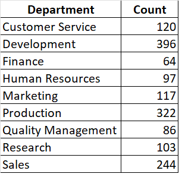
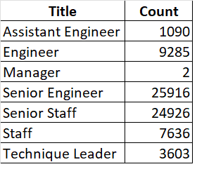
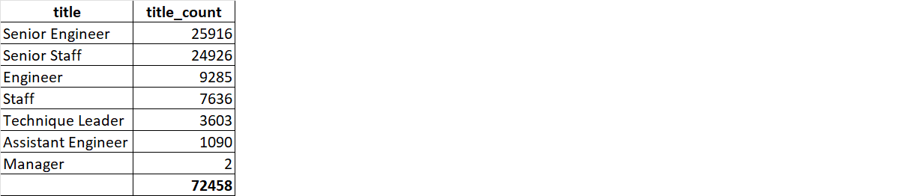
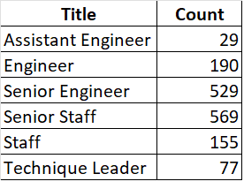

# Pewlett-Hackard-Analysis
# Overview 
	  Here we have to identify how many employees are going to retire soon, and their titles. From this big chunk or the retiring employees, we need to figure 	out the       employees who are eligible to stay back and mentor the new hires.

# Results: 
  * The number of titles filled by employees who are retiring.
  
  * The number of employees, who are about to retire, but still working in the company.
  
  * The department who has the least number of employees, who are about to retire, is Finance.
  
  * The department who has the largest number of employees who are about to retire, is Development.
  

# Summary: 
	* As we can see from the following, total of 72,428 employees are about to retire. 
  * There are enough qualified, retirement-ready employees in the departments to mentor the next generation of Pewlett Hackard employees. Even though number seems        small compared to what the new-hire number will be, there are enough experienced people to coach.
  

then provide two additional queries or tables that may provide more insight into the upcoming "silver tsunami."
