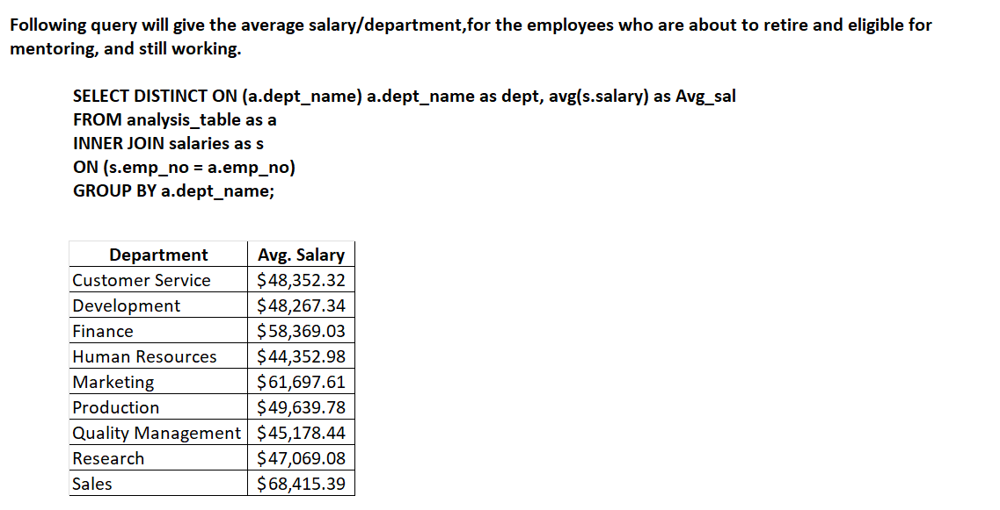

# Pewlett-Hackard-Analysis
# Overview 
  Here we have to identify how many employees are going to retire soon, and their titles. From this big chunk or the retiring employees, we need to figure out the       employees who are eligible to stay back and mentor the new hires.

# Results: 
  * The number of titles filled by employees who are retiring.
  
  
  * The number of employees, who are about to retire, but still working in the company.

   
  * From below image, the department who has the least number of employees, who are about to retire, is Finance.
  * From below image, the department who has the largest number of employees who are about to retire, is Development.
  
  
 
# Summary: 
	* As we can see from the following, total of 72,428 employees are about to retire. 
  	* There are enough qualified, retirement-ready employees in the departments to mentor the next generation of Pewlett Hackard employees.
	  Even though number seems small compared to what the new-hire number will be, there are enough experienced people to coach.
          

	## Addtional query / table:
	Following query will give the average salary/title,for the employees who are about to retire and eligible for mentoring, and still working.
	 
	SELECT DISTINCT ON (m.title) m.title as title, avg(s.salary) as Avg_sal
	FROM mentorship_eligibilty as m
	INNER JOIN salaries as s
	ON (s.emp_no = m.emp_no)
	GROUP BY m.title;
	
	
	
	Following query will give the average salary/department,for the employees who are about to retire and eligible for mentoring, and still working.
	
	SELECT DISTINCT ON (a.dept_name) a.dept_name as dept, avg(s.salary) as Avg_sal
	FROM analysis_table as a
	INNER JOIN salaries as s
	ON (s.emp_no = a.emp_no)
	GROUP BY a.dept_name;
	
